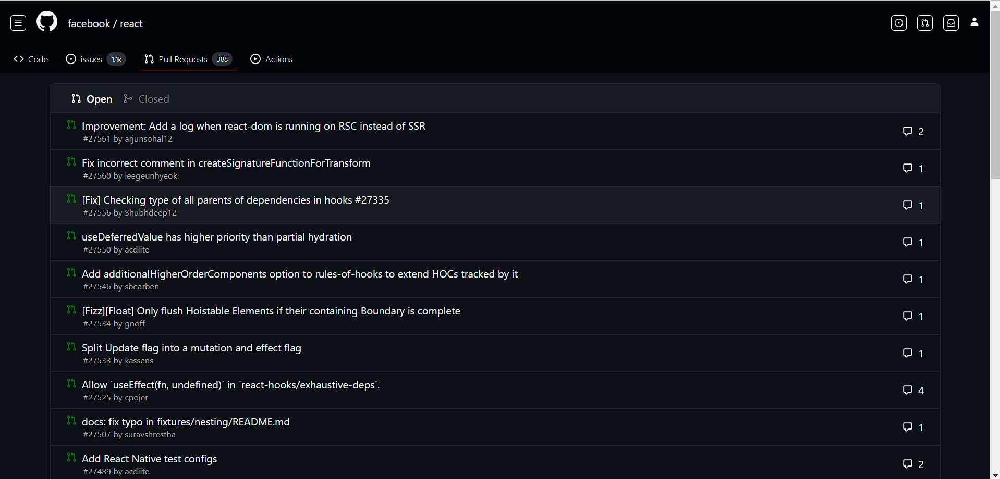

# React Pull Request Page Clone

Welcome to the React Pull Request Page Clone! 👋

This project is a small React app that replicates the Pull Request page of the Facebook/React repository. It's a great way to practice your React skills and understand the structure of a real-world application.

## Table of Contents

- [Demo](#demo)
- [Features](#features)
- [Usage](#usage)
- [Contributing](#contributing)
- [License](#license)

## Demo

## Features

- **Pull Requests:** View a list of pull requests.
- **Details:** See detailed information about each pull request.
- **Toggle Open/Closed:** Switch between open and closed pull requests easily.
- **Responsive:** Switch between open and closed pull requests easily.

## Usage

1. Start the development server: `npm start`
2. Open your browser and go to `http://localhost:3000`
3. Explore the React Pull Request Page Clone!
4. Use the toggle feature to switch between open and closed pull requests.

